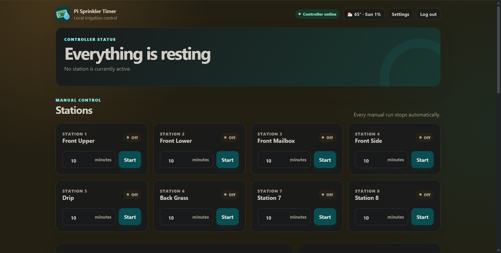
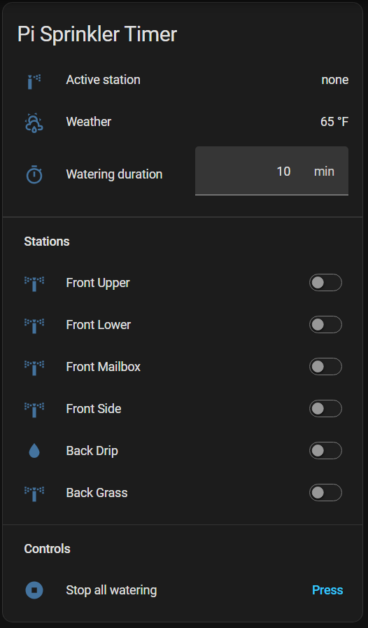

# Pi Sprinkler Timer

Pi Sprinkler Timer is a local-first irrigation controller for Raspberry Pi. It
provides a responsive web dashboard, scheduling, weather-aware holds, run
history, a versioned REST API, and Home Assistant integration.



GPIO Zero controls active-low relay boards through the `lgpio` backend. A
single systemd service owns every relay and automatically turns off manual runs
when their configured time expires.

> **Current release:** Version 3.0.0. The proven `v2.0.0` release remains
> available for legacy installations and rollback.

The `develop/v3.1` branch contains unreleased 3.1 development work. Its
schedule test runs selected schedules in order with a supervised 30-second run
per station, and schedule create/edit validation prevents enabled run windows
from overlapping.

## Features

- Manual station control with a live remaining-time countdown
- Multi-station schedules with editing and local-time execution
- Supervised 30-second test runs for selected schedules
- Schedule overlap prevention, including runs that cross midnight
- Independent manual rain holds and automatic weather holds
- Open-Meteo current conditions and precipitation forecasts
- SQLite schedule, settings, and run-history storage
- Editable station names, BCM GPIO pins, timezone, and safety limits
- Configurable dashboard Stop behavior
- Bearer-authenticated REST API and signed browser sessions
- Home Assistant REST sensors and commands
- Active-low relay safety, serialized GPIO ownership, and automatic shutoff

## Requirements

- Raspberry Pi supported by Raspberry Pi OS
- Raspberry Pi OS Lite Trixie, 32-bit or 64-bit
- Network connection
- Git and HTTPS certificate support for downloading the installer bootstrap
- Compatible active-low relay board
- 24 VAC sprinkler transformer and valves
- Python 3.11 or newer, installed automatically on Trixie

> **Relay safety:** Keep the valve transformer disconnected during installation
> and until the controller starts with every station and relay off. Turn on
> valve power only for supervised station testing.

## Install version 3

The automated installer explains each stage, installs system packages and the
application, runs the test suite, creates the restricted service account,
configures lighttpd, collects the API token, and enables and starts the
controller. It installs the released `v3.0.0` tag by default; use
`--ref develop/v3.1` only for deliberate development testing.
On a first-generation, single-core Raspberry Pi Zero, the initial installation
can take about 15 minutes. Package installation and the test suite may run
quietly for several minutes, so allow the installer to finish unless it reports
an error.

An installer checkout cloned with `--branch v3.0.0 --single-branch` knows only
that release tag. Before testing `develop/v3.1`, update the installer checkout
itself so its migration and health-check logic also comes from the development
branch:

```bash
cd ~/pi-sprinkler-installer
git config --add remote.origin.fetch \
  '+refs/heads/develop/v3.1:refs/remotes/origin/develop/v3.1'
git fetch origin
git switch --create develop/v3.1 --track origin/develop/v3.1
git rev-parse --short HEAD
```

Confirm the final command reports the expected development checkpoint before
running `./scripts/install-v3.sh --ref develop/v3.1`. The `--ref` option selects
the application source installed under `/opt`; it does not update an older
local copy of the installer script.

When updating an installation that already uses the Pi Sprinkler service name,
stop the GPIO-owning controller before rerunning the installer. The installer
refuses to transfer relay ownership while a controller is active and starts the
new service again only after validation:

```bash
sudo systemctl stop pi-sprinkler.service
```

### Upgrading a 3.0 installation with the old technical name

Version 3.0 displayed the Pi Sprinkler Timer product name but retained the old
`open-sprinkler-v3.service` deployment identifier. Stop that service before the
first renamed update:

```bash
sudo systemctl stop open-sprinkler-v3.service
```

The installer migrates the controller configuration, API token, SQLite
schedules and history, TLS certificate, and local certificate authority into
the `pi-sprinkler` paths. It disables and archives the obsolete controller unit
and lighttpd files under `/var/backups/pi-sprinkler/name-migration/`, then starts
only `pi-sprinkler.service`. The old application, configuration, and state
directories remain untouched as a rollback copy. Browser sessions use the new
cookie namespace, so sign in again after the update.

If the optional shutdown-button service was previously installed, rerun
`sudo ./scripts/install-shutdown-button.sh` once to migrate it to
`pi-sprinkler-shutdown-button.service`.

Install the two bootstrap packages needed to download the installer:

```bash
sudo apt update
sudo apt install -y git ca-certificates
```

Then clone the released installer:

```bash
git clone --branch v3.0.0 --single-branch \
    https://github.com/aaronnewcomb/pi-sprinkler-timer.git \
    pi-sprinkler-installer
cd pi-sprinkler-installer
```

### Temporary HTTP acceptance

Use HTTP only for short acceptance testing on a trusted isolated LAN:

```bash
sudo ./scripts/install-v3.sh --mode http
```

The API token is unencrypted on the network in this mode.

### Private-LAN HTTPS

For regular use, provide the stable hostname and IP that the generated
certificate should cover:

```bash
sudo ./scripts/install-v3.sh --mode https \
    --hostname sprinkler.local --ip 192.168.0.50
```

The installer prompts for physical confirmation that valve power is
disconnected. For unattended use, `--valve-power-disconnected` can preconfirm
that condition only after the transformer has actually been disconnected.
Use `--no-start` for a deliberately staged installation.

The installer also explains how to generate and save the API token. Treat the
token like a password, keep it in a password manager, and retain it for browser
sign-in and Home Assistant. It is never printed by the installer.

See the [complete v3 installation and acceptance guide](docs/V3_INSTALLATION.md)
for HTTPS trust setup, troubleshooting, updates, and relay testing.

## Optional GPIO services

- [Physical shutdown button](docs/SHUTDOWN_BUTTON.md)
- [Garage-door MQTT monitor](docs/GARAGE_DOOR_MONITOR.md)

## Initial configuration and acceptance

After installation:

1. Open the web address printed by the installer and sign in with the saved API
   token.
2. Open **Settings** and verify every station name and BCM GPIO pin, the
   timezone, maximum run time, and Stop-button policy.
3. Turn on the valve power and activate each station individually. Confirm that
   only the intended relay turns on.
4. Switch directly between stations and confirm the previous relay turns off.
5. Create and edit a short schedule, then verify its run appears in history.
   Overlapping enabled schedules are rejected; schedules that meet exactly at
   an end/start boundary are allowed.
6. Use **Test schedules** to select one or more schedules. Supervise the test
   while each included station runs for 30 seconds in schedule order, and
   confirm that **Stop test** immediately de-energizes the active relay.
7. Configure weather automation if desired.
8. Review the service log. If any check fails, stop watering and disconnect
   valve power before troubleshooting.

## Home Assistant

A complete YAML starter is split into three copy-ready files:

1. Merge [the REST sensors and commands](docs/home-assistant/rest.yaml) into
   Home Assistant `configuration.yaml`. Replace `PI_SPRINKLER_HOST` with the
   controller hostname or address and use the same HTTP or HTTPS scheme chosen
   during installation.
2. Store the complete authorization value in Home Assistant `secrets.yaml`:

   ```yaml
   pi_sprinkler_authorization: "Bearer YOUR_SAVED_TOKEN"
   ```

   Keep the real token out of source control and chat.
   For HTTPS, Home Assistant must trust the private certificate authority used
   by the controller. `verify_ssl: false` is available on REST sensors and
   commands for temporary trusted-LAN acceptance only; retain certificate
   verification for regular use.
3. Merge [the station entities](docs/home-assistant/station-entities.yaml) into
   `configuration.yaml`. Rename the generic stations to match the controller,
   remove unused stations, and preserve each station's numeric ID. If
   `input_number:` or `template:` already exists, merge their children rather
   than creating duplicate top-level keys.
4. Check the Home Assistant configuration and perform a full restart. Confirm
   the REST sensors, station switches, duration helper, and Stop All button
   appear under **Developer Tools → States**.
5. Add a dashboard **Manual** card and paste
   [the Entities card template](docs/home-assistant/dashboard.yaml). Adjust any
   entity IDs that Home Assistant changed to avoid a naming collision.



The duration helper applies to the next manual station start. Each station
switch reflects the active station, starts a bounded run when enabled, and
stops that station when disabled. The Entities card deliberately disables its
header toggle because the controller permits only one active station. The Stop
All button remains available as an unconditional safety action. Keep the
helper's maximum at or below the controller's configured manual-run limit.

The REST API is served under `/api/v1`. The web dashboard is one API client,
so browser and Home Assistant actions use the same controller and safety rules.

## Important paths

| Purpose | Path |
| --- | --- |
| Application source | `/opt/pi-sprinkler/source` |
| Python environment | `/opt/pi-sprinkler/.venv` |
| Controller configuration | `/etc/pi-sprinkler/pi-sprinkler.ini` |
| API token | `/etc/pi-sprinkler/api-token` |
| Controller database | `/var/lib/pi-sprinkler/pi-sprinkler.db` |
| systemd service | `/etc/systemd/system/pi-sprinkler.service` |
| lighttpd proxy | `/etc/lighttpd/conf-available/99-pi-sprinkler.conf` |

Common service commands:

```bash
systemctl status pi-sprinkler.service --no-pager -l
sudo systemctl restart pi-sprinkler.service
journalctl -u pi-sprinkler.service -n 80 --no-pager
```

## Optional physical shutdown button

The repository includes a systemd-based replacement for the legacy Python 2
shutdown listener. It uses BCM GPIO 3, physical pin 5, by default:

```bash
sudo ./scripts/install-shutdown-button.sh
```

The installer uses GPIO Zero with `lgpio`, disables the matching `rc.local` and
SysV startup entries after backing them up, and enables the new service. See
the [physical shutdown button guide](docs/SHUTDOWN_BUTTON.md) for pin changes,
service commands, and the migration safety details.

## Development

Version 3 requires Python 3.11 or newer. Use
[uv](https://docs.astral.sh/uv/) for a local development environment:

```bash
uv sync
uv run pytest
```

The suite covers the controller, scheduler, persistence, API, authentication,
weather automation, GPIO safety, web assets, deployment files, and installer.

## Documentation

- [Version 3 installation and acceptance](docs/V3_INSTALLATION.md)
- [Version 3 architecture and roadmap](docs/V3_ARCHITECTURE.md)
- [Home Assistant REST starter](docs/home-assistant/rest.yaml)
- [Home Assistant station entities](docs/home-assistant/station-entities.yaml)
- [Home Assistant dashboard card](docs/home-assistant/dashboard.yaml)
- [Legacy version 2 reference](docs/V2_INSTALLATION.md)

## Legacy version 2

Version 2 remains preserved at the `v2.0.0` tag for rollback and existing
installations. Do not run the v3 installer over an old production OS or
overwrite a working v2 boot card. See the
[legacy v2 reference](docs/V2_INSTALLATION.md).

## License

See [LICENSE](LICENSE).
