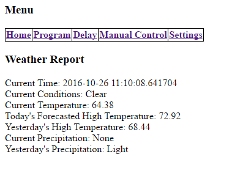

# Pi Sprinkler Timer
A DIY web-driven scheduler for Raspberry Pi OS, written in Python 3 and served by lighttpd. GPIO Zero controls active-low relay boards through the `lgpio` backend. The scheduler runs as a systemd service.

## Version 3 development

The proven `v2.0.0` release and the installation procedure below remain the
recommended version for real sprinkler hardware. Version 3.0 is being built on
the `develop/v3` branch and must not replace a working 2.0 controller yet.

The first three 3.0 milestones add a single-owner relay controller, a versioned
REST API, automatic shutoff, transactional SQLite schedules, rain delays, run
history, a starter Home Assistant configuration, and a responsive web
dashboard. Optional Open-Meteo automation can pause schedules around configured
precipitation while keeping manual holds independent. API clients use bearer authentication. Browsers exchange that token
for a signed session with CSRF protection. See
[the 3.0 architecture and phased roadmap](docs/V3_ARCHITECTURE.md).

The 3.0 user interface and documentation use the Pi Sprinkler Timer name. The
existing `open-sprinkler` package, service, configuration, and API identifiers
remain unchanged during 3.0 development so current test installations continue
to work.

Develop and test 3.0 in an isolated environment with
[uv](https://docs.astral.sh/uv/):

```bash
uv sync
uv run pytest
```

This runs the retained 2.0 regression suite and the new controller,
persistence, scheduler, API, browser-authentication, and deployment tests
together. A separate Raspberry Pi can now follow the
[3.0 test installation and acceptance procedure](docs/V3_INSTALLATION.md).
Keep the production 2.0 controller untouched until that hardware acceptance is
complete.

For a fresh test Pi, `scripts/install-v3.sh` automates the installation while
preserving existing configuration and secrets. It defaults to the tested
`v3-ui-checkpoint-2026-09-17` tag and refuses to start GPIO control without an
explicit valve-power-disconnected confirmation. See the installation guide for
temporary HTTP and private-LAN HTTPS examples.

Weather automation requires outbound HTTPS and DNS access to
`api.open-meteo.com` and `geocoding-api.open-meteo.com`. It does not require an
API key for the project's non-commercial use. Location and threshold settings
are stored in the controller database and can be changed from the web Settings
dialog.

Controller Settings also manages station names, BCM GPIO pins, timezone, the
maximum run time, and the header Stop-button policy. Names, timezone, limits,
and Stop behavior apply immediately. GPIO changes are persisted but require a
service restart before the controller claims different relay lines. Existing
schedules can be opened with **Edit** and updated in place.

(If you are looking for a more turnkey and feature rich solution for your RPi, I highly recommend [OpenSprinkler Pi](https://opensprinkler.com/product/opensprinkler-pi/) instead.)

## Parts
* Raspberry Pi
  * Network connection
  * Power supply for the Raspberry Pi
* 24V AC Sprinkler Power Supply
* Sprinkler Valves
* 5V Relay Board

## Prerequisites

Use a current Raspberry Pi OS release. Install the web server, Python 3, GPIO Zero, and the `lgpio` pin library from APT:

```bash
sudo apt update
sudo apt install lighttpd apache2-utils python3 python3-gpiozero python3-lgpio
```

GPIO access is performed only by the scheduler service. The CGI scripts send commands to that service over a loopback-only TCP socket.

The installation and hardware acceptance procedure below was verified on a
Raspberry Pi 4 running Raspberry Pi OS Bookworm, Python 3.11, and the Raspberry
Pi `6.12` kernel.

> **Safety:** Keep the 24 VAC valve transformer disconnected until the service
> startup, shutdown, and individual relay tests have all passed. This prevents
> unexpected watering while GPIO behavior is being verified.

Clone the repository and run the complete test suite on the target Pi:

```bash
git clone https://github.com/aaronnewcomb/pi-sprinkler-timer.git
cd pi-sprinkler-timer
PYTHONDONTWRITEBYTECODE=1 python3 -W error \
    -m unittest discover -s tests -v
```

## Installation
### Configure lighttpd to run Python scripts with password protection

#### 1. Enable the CGI and authentication modules

```bash
sudo lighty-enable-mod cgi
sudo lighty-enable-mod auth
```

On Raspberry Pi OS Bookworm, the packaged CGI configuration maps `/cgi-bin/` to `/usr/lib/cgi-bin/` and uses each executable script's Python 3 shebang.

#### 2. Create a digest authentication file

Check that the target is new because `htdigest -c` creates or replaces the file:

```bash
sudo test ! -e /etc/lighttpd/open-sprinkler.htdigest
sudo htdigest -c /etc/lighttpd/open-sprinkler.htdigest "Pi Sprinkler Timer" admin
sudo chown root:www-data /etc/lighttpd/open-sprinkler.htdigest
sudo chmod 640 /etc/lighttpd/open-sprinkler.htdigest
```

Enter the password only at the masked terminal prompts. Do not store it in this repository or in shell history.

Digest authentication protects the password file, but HTTP traffic is not
encrypted. Use this configuration only on a trusted network until HTTPS is
configured.

#### 3. Protect the CGI directory

Create `/etc/lighttpd/conf-available/99-open-sprinkler.conf` with:

```lighttpd
server.modules += ( "mod_authn_file" )

auth.backend = "htdigest"
auth.backend.htdigest.userfile = "/etc/lighttpd/open-sprinkler.htdigest"

auth.require = (
    "/cgi-bin/" => (
        "method"  => "digest",
        "realm"   => "Pi Sprinkler Timer",
        "require" => "user=admin"
    )
)
```

Enable the configuration:

```bash
sudo ln -s ../conf-available/99-open-sprinkler.conf \
    /etc/lighttpd/conf-enabled/99-open-sprinkler.conf
```

#### 4. Validate and restart lighttpd

```bash
sudo lighttpd -tt -f /etc/lighttpd/lighttpd.conf
sudo systemctl restart lighttpd
systemctl status lighttpd --no-pager
```

### Copy the application

Install the web files. Raspberry Pi OS maps `/cgi-bin/` to `/usr/lib/cgi-bin/`, which is also the path expected by the included service:

```bash
sudo install -m 0755 -o root -g root ./*.py /usr/lib/cgi-bin/
sudo install -m 0644 -o www-data -g www-data index.html /var/www/html/index.html
```

Create the runtime configuration. This separate step prevents a deployment from overwriting an existing configuration:

```bash
if [ ! -e /usr/lib/cgi-bin/sprinkler.config ]; then
    sudo install -m 0660 -o www-data -g www-data \
        sprinkler.config.example /usr/lib/cgi-bin/sprinkler.config
fi
sudoedit /usr/lib/cgi-bin/sprinkler.config
```

GPIO numbers use Broadcom (BCM) numbering. Set the station pins for your relay board, then add the Pirate Weather API key, latitude, and longitude if weather reporting is desired.

For an existing installation, preserve the previous `sprinkler.config` outside
the web directory before copying application files. Review it for the current
section names, then install it at `/usr/lib/cgi-bin/sprinkler.config` with owner
and group `www-data` and mode `0660`. Never commit a runtime configuration or
API key to the repository.

### Install the systemd service

Install and validate the scheduler service without starting it:

```bash
sudo install -m 0644 systemd/open-sprinkler.service /etc/systemd/system/open-sprinkler.service
sudo systemctl daemon-reload
sudo systemd-analyze verify /etc/systemd/system/open-sprinkler.service
```

If this Pi previously used the legacy startup instructions, remove the
`pigpiod &` and `sprinkler.py &` lines from `/etc/rc.local`. Disable an existing
`pigpiod` service and verify that no old scheduler owns the loopback port:

```bash
if systemctl list-unit-files pigpiod.service --no-legend | grep -q pigpiod; then
    sudo systemctl disable --now pigpiod.service
fi
sudo ss -ltnp | grep ':5555' || echo "TCP port 5555 is free"
```

Only one scheduler process should control the relay pins.

With the valve transformer disconnected, start the service without enabling it
at boot. All relay indicators must remain off:

```bash
sudo systemctl start open-sprinkler.service
systemctl status open-sprinkler.service --no-pager -l
sudo ss -ltnp | grep ':5555'
journalctl -u open-sprinkler.service -n 50 --no-pager
```

The socket must listen only on `127.0.0.1:5555`. Verify the scheduler reports
every station off, then stop it and confirm a clean shutdown:

```bash
python3 - <<'PY'
import socket

with socket.create_connection(("127.0.0.1", 5555), timeout=3) as connection:
    connection.sendall(b"station_status:0")
    print(connection.recv(512).decode("utf-8"))
PY

sudo systemctl stop open-sprinkler.service
systemctl is-active open-sprinkler.service
sudo ss -ltnp | grep ':5555' || echo "TCP port 5555 released"
```

All stations must report `off`, the service must become inactive, and every
relay must remain off. After those checks pass, enable and start the service:

```bash
sudo systemctl enable --now open-sprinkler.service
systemctl is-enabled open-sprinkler.service
systemctl is-active open-sprinkler.service
```

The service runs as `www-data` with `gpio` as a supplementary group, restarts after failures, and turns all configured relays off during a normal stop. It binds its control socket to `127.0.0.1:5555`, so relay commands are not accepted from other network hosts.

The unit also creates `/run/open-sprinkler/` as a private writable runtime
directory. The `lgpio` library needs this directory for its temporary
notification pipe; the application files under `/usr/lib/cgi-bin/` remain
read-only.

### Give it a try
Open a web browser and enter the hostname or IP address of the Raspberry Pi.
Authenticate with the digest username and password created above. Verify the
Home, Program, Delay, Manual Control, and Settings pages before changing a
relay.



### Test before connecting valves

With the valve transformer still disconnected, use **Manual Control** to
activate each station individually. Confirm that only the selected relay is on,
then turn it off before proceeding. Also switch directly from Station 1 to
Station 2 and verify that Station 1 turns off before Station 2 remains active.

After all stations pass, confirm that the page reports every station off and
review both service logs for new errors:

```bash
journalctl -u open-sprinkler.service -n 50 --no-pager
sudo tail -n 50 /var/log/lighttpd/error.log
```

Reconnect valve power only after all software and relay checks succeed.

## Known limitations

- HTTPS setup is not yet included. Restrict the current HTTP interface to a
  trusted network.
- Web-based reboot and shutdown are not enabled by these instructions. Do not
  grant the web-server account broad passwordless `sudo` access. A restricted
  replacement can be added in a future hardening update.
- The interface retains the original project's basic visual design.
